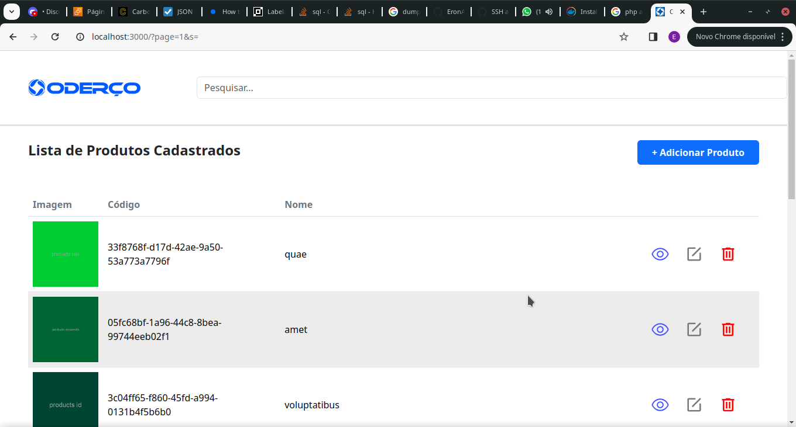
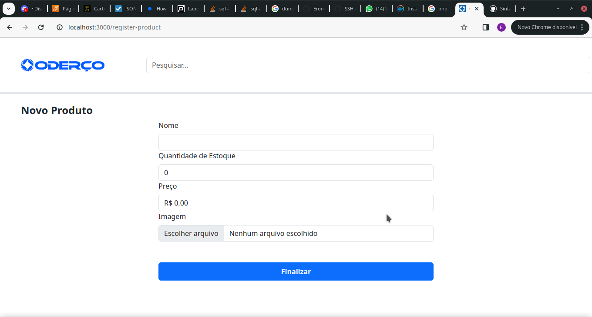
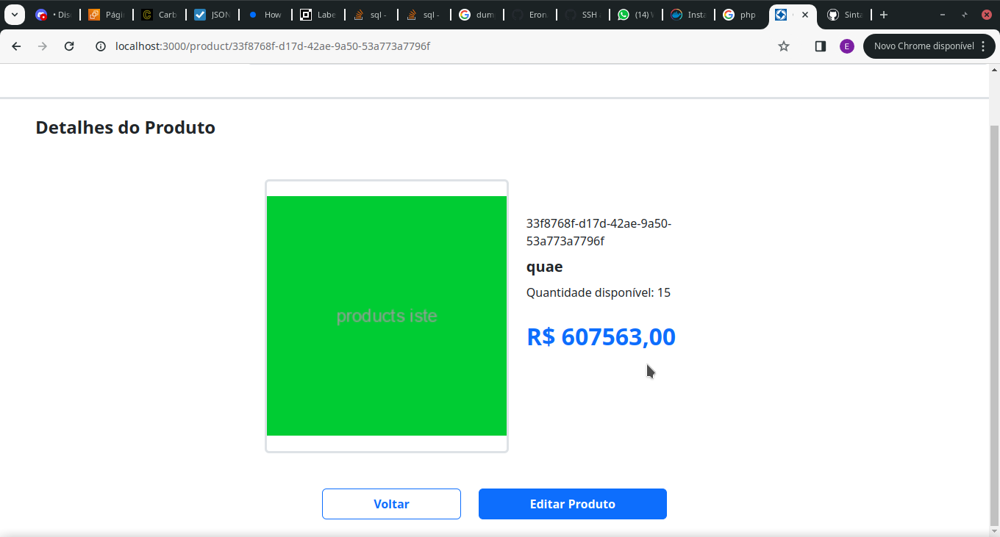
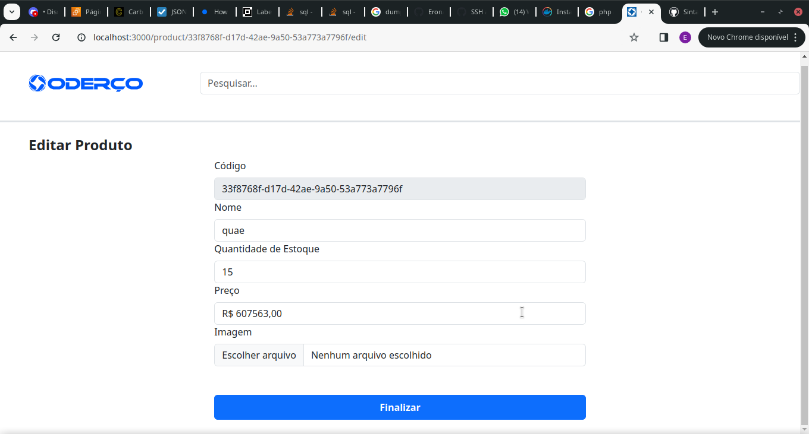
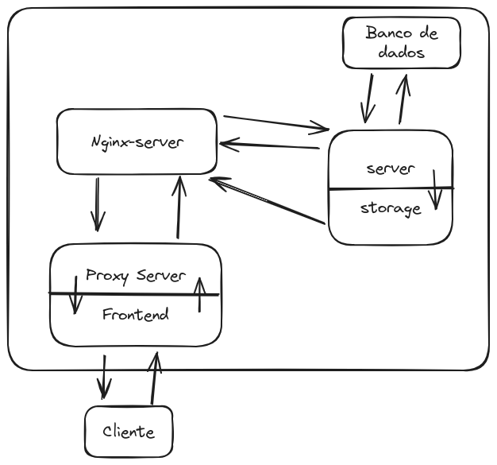

# Oderço Warehouse

Projeto de sistema de gestão de produtos e armazém como requisito do processo seletivo da Oderço.

## Tecnologias Utilizadas

* PHP 8.2
* Laravel 11
* Vue 3
* Nuxt 3
* MySQL

## Módulos

* **nginx-server**: Contém configuração do web server nginx utilizado no Projeto
* **server**: Contém o código do servidor Laravel, responsável pelo backend da aplicação
* **web**: Contém o código do front-end em Nuxt.js
* **db**: Contém o script de inicialização do banco de dados em MySQL

## Rodando o projeto 

O projeto é totalmente virtualizado em containers docker. Sendo assim, é necessário que na máquina onde será executado, esteja instalado:

* Docker 
* Docker compose 

Dito isso, para inicializar o projeto, basta rodar o comando abaixo:

```sh
$ docker compose up -d
```

A flag `-d` indica que os containers devem rodar com os streams de entrada/saida 'desatachados' da sessão de terminal atual.
Leva em média 1 a 2 minutos para montagem e execução dos containers. Por isso, executar o projeto sem a flag `-d` pode ser 
útil para verificar se está tudo funcionando e pronto para ser utilizado.

Após o projeto subir, basta acessar `http://localhost:3000/` e você será direcionado para a página principal da aplicação.

## Seedando a aplicação

Injetar dados pré-definidos pode ser útil para verificar a aplicação. 
Para isso, sem que o usuário precise inserir todos os dados manualmente, basta rodar a sequencia de comandos
comando abaixo após os containers terem sido criados e estarem rodando.

```sh
# Inicia uma seção de terminal no conatainer
docker exec -it oderco-warehouse-server sh

# Configura a variavel APP_ENV para 'local'. Migrações e Seeds só rodam quando
# esta variável está configurada como 'local'
export APP_ENV=local 

# Limpa o cache de configurações do laravel 
php artisan config:clear

# Refaz o cache de configurações do laravel 
php artisan config:cache 

# Realiza o seed 
php artisan db:seed 

# Limpa o cache de configurações do laravel 
php artisan config:clear 

# Volta o APP_ENV para production
export APP_ENV=production 

# Refaz o cache de configurações do laravel 
php artisan config:cache

# Sai do terminal do container 
exit
```

## Estrutura externa da aplicação

### Página principal 



Página inicial da aplicação. Exibe os produtos cadastrados, separados por páginas de 10 itens cada.
Abriga também os resultados das buscas por nome. Além da funcionalidade de deletar produto.

### Adicionar Produto



Tela para adicionar um novo produto.
Valida os dados inseridos, bem como formato da imagem inserida. 

### Visualizar Produto



Tela para visualizar os dados do produto.

### Editar produto 



Tela para editar os dados do produto. Contém as mesmas validações presentes na tela 
de inserir novo produto.

## Macro-Arquitetura da aplicação 



A Arquitetura da aplicação é simples e de semi-produção, visto que as requisições
São todas gerenciadas pelo módulo de front-end. 

Esta arquitetura pode ser facilmente modificada para produção apenas adicionando um NGINX 
na frente do servidor de front-end para que ele faça toda a parte de proxificação 
e gerenciamento dos recursos. 

## Arquitetura dos módulos 

### Web 

O módulo de web utiliza arquitetura e esquema de pastas padrão do Nuxt.js. 
Foram feitos alguns componentes em separado, obedecendo o princípio de DRY.

Em algumas partes foi necessário utilização de máscara de valores (2.00 => R$ 2,00).
Para isso, foi utilizado a biblioteca Maska, junto com customizações adicionais 
feitas por mim para garantir o melhor funcionamento possível. 

Foi usado também a biblioteca `toastify` para exibir algumas mensagens de erro 
de forma fácil e dinâmica. 

#### Envio dos dados 

O envio dos dados são feitos sempre sob a forma POST, como corpo em form-data. 
Essa escolha foi feita para poder facilitar o envio de imagens. 

Há outras opções para isso, como utilizar json e base64, porém a desvantagem é 
que o encoding de um binário para base64 pode duplicar ou triplicar o seu tamanho,
além de adicionar complexidade à aplicação. 

#### POST também para atualizar os dados?

Como o padrão da web é utilizar forms apenas com `GET` e `POST`, o servidor não reconhece
dados na forma form-data quando enviamos como `PUT`. 

Sendo assim, os dados estão sendo enviados como `POST`, porém, foi feito adição do 
query param `_method=PUT` para indicar que no servidor, esses dados devem ser tratados
pelo mesmo método que trata requisições `PUT`.

#### Proxificação 

Como informado, o front-end assume toda a parte de proxificação das requisições. 
Isso é feito através do servidor nitro que vem junto com o Nuxt.

A proxificação é feita através da função `proxyRequest` do `unjs`, e ela foi implementada
para os paths `/api/[...]` e `storage/[...]`.

#### Validação de dados 

Os dados dos formulários são validados utilizando Vuelidate.

Os dados que o front-end recebe do back-end também são validados, utilizando 
a biblioteca Zod.

### Nginx-server 

O servidor de nginx é simples, contendo apenas um arquivo de configuração.

O mesmo está configurado para servir arquivos estáticos do storage. 
Caso ele não encontre o arquivo, a requisição é encaminhada para o index.php,
utilizando o php-fpm como motor de CGI para tal. 

### Server 

O servidor foi feito seguindo a arquitetura MVC que o próprio laravel segue por padrão.
Nenhuma outra biblioteca foi adicionada além daquelas que já vêm com o próprio laravel. 

#### Rotas

* `/api/products`
    * **GET**: Lista todos os produtos, com paginação de 10 produtos por página. Suporta busca pelo nome, bastando apenas informar no query param `s`.
    * **POST**: Cria um novo produto. 
* `/api/products/{public_id}`
    * **GET**: Retorna somente um produto conforme o `public_id`.
    * **PUT**: Atualiza o produto conforme o `public_id`.
    * **DELETE**: Deleta o produto. Essa exclusão é feita de forma soft. O produto em questão ainda existe, porém com uma informação de exclusão.

#### Validação

A validação é feita através do próprio validador do laravel. Segue as mesmas validações 
do front-end. 

#### Gerenciando arquivos 

Imagens são guardadas no `storage` do servidor para serem servidas através do nginx, sendo salvo no banco de dados 
apenas o nome da imagem.

O model do Produto possui um getter para retornar a url completa da imagem para o requisitante.

Optou-se por não utilizar um setter para a imagem no model, para ter um controle mais fino de rollback, em caso 
de falha ao salvar/atualizar um produto.

#### Testes 

Esta parte da aplicação possui teste para os seus quatro endpoints. 
Testes foram feitos utilizando o php-unit. 
Mais abaixo é informado como rodar os testes.

### Banco de dados 

O banco de dados é um MySQL, e contém apenas a tabela `product`, que segue o esquema 
abaixo:

* **id**: Id inteiro autoincrementável 
* **public_id**: UUID gerado pela aplicação. Deve ser único
* **name**: varchar 100. Deve ser único
* **quantity**: Inteiro sem sinal 
* **picture**: nome do arquivo da imagem no storage 
* **price**: BigInteger sem sinal 
* **deleted_at**: indica quando o registro foi deletado 
* **created_at** e **updated_at**: timestamps

#### Um id e um public_id 

Optou-se por esta estratégia para evitar previsibilidade na identificação dos dados,
ao mesmo tempo, se aproveitando de um índice que é comparável, permitindo otimização de 
queries pelo banco de dados.

#### Price como inteiro e não como float 

Valores monetários são tem dois dígitos de exatidão sempre. 
Para evitar quebra dos valores além desses dois dígitos, estes valores são 
guardados como inteiro, e são convertidos durante recuperação ou persistência dos dados. 

## Rodando os testes 

Para facilitar os testes do back-end, o Dockerfile do mesmo possui um stage 
para poder executar esses testes.

Após subir todos os containers, basta rodar o comando abaixo:

```sh
cd server 
docker build . --target=test
```

O docker irá construir uma imagem que irá executar os testes do back-end.
Basta observar qual será o resultado.

**ATENÇÃO**: é necessário que o banco de dados esteja rodando neste momento, por 
isso o requisito de que os containers estejam rodando. Além disso, os testes limpam
completamente o banco de dados.
